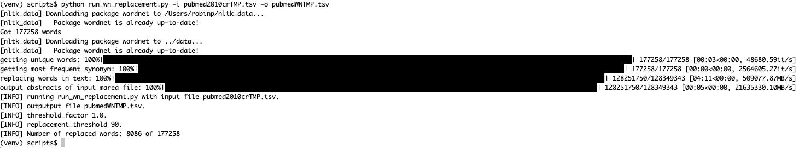

# Tutorial

Here, we demonstrate all the steps required to run the wn2vec pipeline on a small input dataset consisting of 100,000 abstracts from PubMed. The pipeline can be run similarly with all PubMed abstracts or any other input source.

## 1. Setting Up the Environment

There are several ways to run the code, but the simplest is to set up a virtual environment. We call the environment `wn2v_env` in this example, but you can use any name you like.

```shell
python3 -m venv wn2v_env
source wn2v_env/bin/activate
pip install .
```
Note that wn2vec requires Python 3.


## 2. Downloading the Data

The input data for this tutorial consists of a file with 100,000 abstracts from PubMed that have been processed using the marea pipeline for medical concept replacement.

The file can be downloaded from Zenodo: [pubmed_cr.tsv](https://zenodo.org/record/7588919/files/pubmed_cr.tsv?download=1).


## 3 (Optional) Preparing the input file with marea

The file we downloaded above has been pre-processed using [MAREA](https://github.com/TheJacksonLaboratory/marea){:target="_blank"}. For new data, you will
need to use marea or an analogous tool. See [Running marea](marea.md) for details.

## 4. Filter By Year
After you have downloaded the `pubmed_cr.tsv` file (or prepared your own input file to have the same format), the next step is to filter by certain year if you want.

For example if you would like publication above the year of 2010, if you would like to proceed with all the text, please skip this step:

```shell
cd scripts
python filter_by_year.py -i ../pubmed_cr.tsv -o ../pubmed_filt.tsv -y 2010
```

## 5. WordNet Replacement

We proceed with the `pubmed_filt.tsv` file (or prepared your own input file to have the same format), the next step is to perform the WordNet non-biomedical concept replacement. Run the following script (which is in the `scripts` directory -- note that the example does not show full paths).

```shell
# Note: still in scripts folder
python run_wn_replacement.py -i ../pubmed_filt.tsv -p PREFIX [--threshold <float>]
```

The `-i` argument points to the input file. The `-p` argument is a prefix that will be used to create two files:

- PREFIX-WN.txt: Text of the abstracts **with** WordNet replacements, one abstract per line
- PREFIX-abstracts.txt: Text of the abstracts **without** WordNet replacements, one abstract per line

The `--threshold` is a floating number that controls the minimum (threshold) count of a synonym to be replaced. First, the mean word count of all words (tokens) in the entire corpus is determined. For example, the mean could be &mu; = 400, meaning that the average word occurs 400 times in the entire corpus of texts. If the threshold is set to &tau; = 2.0, then, the minimum count for being replaced would be &tau;&mu; = 800.

The output file has the same number of abstracts as the input file, except that some words are replaced by more common synonyms, and the format changed to be just one column which is the abstracts only.

When the script is run, it will either download or preload the WordNet vocabulary (which may take a minute or so). Once it starts to perform sysnonym replacement, you will see a progress bar similar to the following.





### Input Text (Excerpt)


The text is formatted in three tab-separated columns with column 1 being the PubMed identifier, column 2 being the year of publication, and column 3 being the abstract text with concept replacements. The following table shows an example.

> 33500803	2020	colloid cyst curtail case report spontaneous colloid cyst regression (...) discover colloid cyst image perform transient meshd009461 ct mri brain reveal 5mm lesion

### WordNet-Replaced Text (Excerpt)

> colloid cyst restrict case report spontaneous colloid cyst regression (...) discover colloid cyst image perform transient meshd009461 ct mri brain reveal 5mm lesion

Thus, the relatively rare word `curtail` was replaced by the more common synonym `restrict`.


## 6. Word2Vec

The next step is to run word2vec on the replaced input file. If desired, word2vec can be run on both files for comparison purposes; the steps are analogous.


Now, run each file with abstracts through word2vec. If you want to compare both files to test the impact of WordNet-based synonym replacement, run the following code twice:

```shell
python run_word2vec.py -i pubmed_filt_abst.tsv -p pm
python run_word2vec.py -i pubmed_wn.tsv -p wn
```

Running the script with the argument `-p` (long form `--prefix`) to "pm" will create output files pm_vector.tsv and pm_metadata.tsv.

Remember to run this code twice with separate paths for the input and different names for vectors and metadata if you want to compare two separate files. Note: all custom vector names should end with '_vector' and metadata should end '_metadata'.

## 7. Compare Embeddings

This step comes after you have 2 vector files and 2 metadata files for two separate corpora generated from the step above. This step evaluates the impact of WordNet-based synonym replacement on the corpus. The test will be done on different biomedical sets as detailed in [Concept Set Evaluation](conceptset_evaluation.md):

```shell
python compare_embeddings.py -i metadata_vectors/ -c data/bio_geneset.tsv -p filt -w wn -o /comn_concepts.tsv
```

Repeat this step for multiple concept sets to check how different concepts' embeddings behave.

## 8. Result Interpretation

We performed two tests, one is the cluster mean distance between genes of the same set, and the second is PairTest.

- **WN**: refers to the *WordNet replaced corpus*.
- **PM**: refers to the *marea output* (none of the concepts were replaced using WordNet).

For example:

- **WN relevant concepts 1302 and PM relevant concepts 1302**: This means there were *1302 genes* both in the WN and PM corpus, and in the biocarta_canonical_gene_set (concept set).
- **WN sig 22 and PM sig 3**: This indicates that *22 concept sets* in the WN corpus had a *significantly lower cluster mean distance* compared to only *3* in the PM corpus.
- **WN LESS 165 and PM LESS 117 (irrespective of p-value)**: There were *165 concept sets* in WN with a lower cluster mean distance compared to *117* in PM.
- WN sig PairTest 106249 and PM sig PairTest 90127
- WN LESS PairTest 130706 and PM LESS PairTest 113559 (irrespective of p-value)

#### Explanation:

- **WN vs. PM**: The comparison is between two different corpora - one processed with WordNet (WN) and the other with marea (PM).
- **Relevant Concepts**: The number (1302) signifies the count of genes common between the analyzed corpus and a specific gene set.
- **Significance (sig)**: The number of concept sets where the WordNet approach showed a statistically significant improvement in clustering compared to marea.
- **LESS**: Indicates the number of concept sets where the mean distance between concepts is less (closer), suggesting better clustering or relatedness in the corpus.
- **PairTest**: Represents a detailed comparison test between the two corpora, indicating how many times one performed better than the other in terms of clustering concepts.
